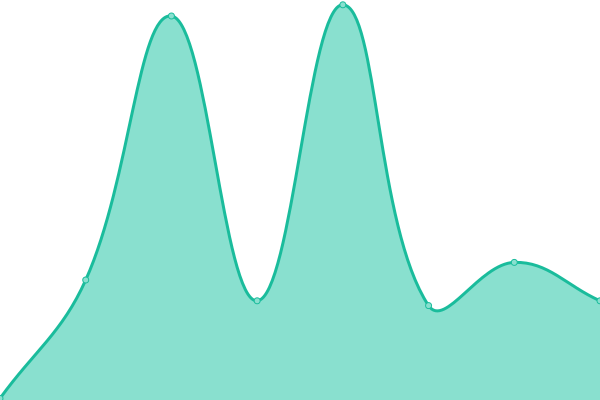
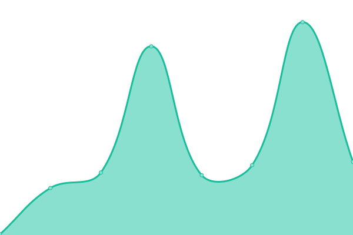

# [📈 Live Status](https://Waynenet.github.io/upptime): <!--live status--> **🟧 Partial outage**

This repository contains the open-source uptime monitor and status page for [Wayne](soga.ml), powered by [Upptime](https://github.com/upptime/upptime).

With [Upptime](https://upptime.js.org), you can get your own unlimited and free uptime monitor and status page, powered entirely by a GitHub repository. We use [Issues](https://github.com/Waynenet/upptime/issues) as incident reports, [Actions](https://github.com/Waynenet/upptime/actions) as uptime monitors, and [Pages](https://Waynenet.github.io/upptime) for the status page.

<!--start: status pages-->
<!-- This summary is generated by Upptime (https://github.com/upptime/upptime) -->
<!-- Do not edit this manually, your changes will be overwritten -->
<!-- prettier-ignore -->
| URL | Status | History | Response Time | Uptime |
| --- | ------ | ------- | ------------- | ------ |
|  [大师兄影视](https://dsxys.pro) | 🟥 Down | [.yml](https://github.com/Waynenet/upptime/commits/HEAD/history/.yml) | 

 475ms
     
 | 

<a href="https://Waynenet.github.io/upptime/history/">100.00%</a>
    

|  [555电影](https://www.5ying.fun) | 🟥 Down | [555.yml](https://github.com/Waynenet/upptime/commits/HEAD/history/555.yml) | 

 0ms
     
 | 

<a href="https://Waynenet.github.io/upptime/history/555">100.00%</a>
    

|  [低端影视](https://ddys.tv) | 🟥 Down | [.yml](https://github.com/Waynenet/upptime/commits/HEAD/history/.yml) | 

 475ms
     
 | 

<a href="https://Waynenet.github.io/upptime/history/">100.00%</a>
    

|  [COKEMV影视](https://cokemv.me) | 🟥 Down | [cokemv.yml](https://github.com/Waynenet/upptime/commits/HEAD/history/cokemv.yml) | 

 207ms
     
 | 

<a href="https://Waynenet.github.io/upptime/history/cokemv">100.00%</a>
    

|  [MK影视](https://www.mkvdo.com) | 🟩 Up | [mk.yml](https://github.com/Waynenet/upptime/commits/HEAD/history/mk.yml) | 

 648ms
     
 | 

<a href="https://Waynenet.github.io/upptime/history/mk">100.00%</a>
    

|  [NO视频](https://www.novipnoad.com) | 🟥 Down | [no.yml](https://github.com/Waynenet/upptime/commits/HEAD/history/no.yml) | 

 645ms
     
 | 

<a href="https://Waynenet.github.io/upptime/history/no">100.00%</a>
    

|  [完美看看](https://www.wanmeikk.film) | 🟥 Down | [.yml](https://github.com/Waynenet/upptime/commits/HEAD/history/.yml) | 

 473ms
     
 | 

<a href="https://Waynenet.github.io/upptime/history/">100.00%</a>
    

|  [Auete影视](https://auete.com) | 🟩 Up | [auete.yml](https://github.com/Waynenet/upptime/commits/HEAD/history/auete.yml) | 

 443ms
     
 | 

<a href="https://Waynenet.github.io/upptime/history/auete">100.00%</a>
    

|  [大米星球](https://www.dmxq.fun) | 🟥 Down | [.yml](https://github.com/Waynenet/upptime/commits/HEAD/history/.yml) | 

 473ms
     
 | 

<a href="https://Waynenet.github.io/upptime/history/">100.00%</a>
    

|  [去看吧](https://www.qkan8.com) | 🟥 Down | [.yml](https://github.com/Waynenet/upptime/commits/HEAD/history/.yml) | 

 473ms
     
 | 

<a href="https://Waynenet.github.io/upptime/history/">100.00%</a>
    

|  [bangumi](https://bangumi.online) | 🟥 Down | [bangumi.yml](https://github.com/Waynenet/upptime/commits/HEAD/history/bangumi.yml) | 

 70ms
     
 | 

<a href="https://Waynenet.github.io/upptime/history/bangumi">100.00%</a>
    

|  [美剧行星](https://www.nfyingshi.com) | 🟥 Down | [.yml](https://github.com/Waynenet/upptime/commits/HEAD/history/.yml) | 

 473ms
     
 | 

<a href="https://Waynenet.github.io/upptime/history/">100.00%</a>
    

|  [天空影视](http://tkznp9.com) | 🟥 Down | [.yml](https://github.com/Waynenet/upptime/commits/HEAD/history/.yml) | 

 473ms
     
 | 

<a href="https://Waynenet.github.io/upptime/history/">100.00%</a>
    

<!--end: status pages-->

[**Visit our status website →**](https://Waynenet.github.io/upptime)

## 📄 License

- Powered by: [Upptime](https://github.com/upptime/upptime)
- Code: [MIT](./LICENSE) © [Wayne](soga.ml)
- Data in the `./history` directory: [Open Database License](https://opendatacommons.org/licenses/odbl/1-0/)
